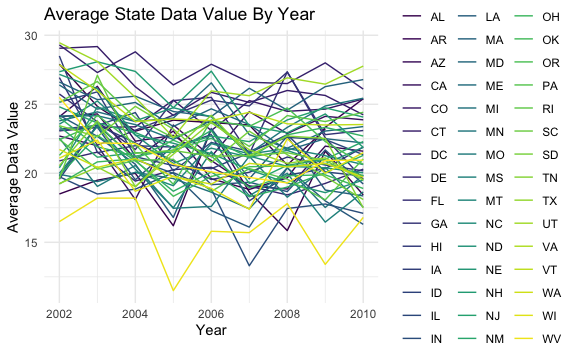
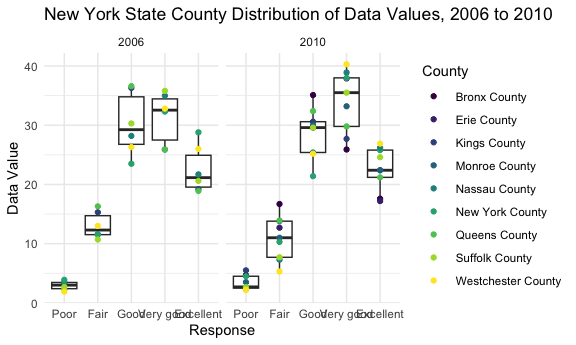
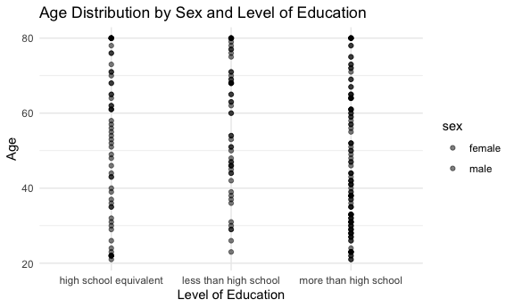
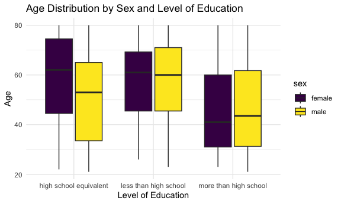
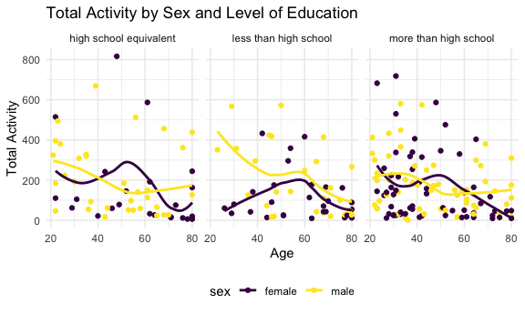
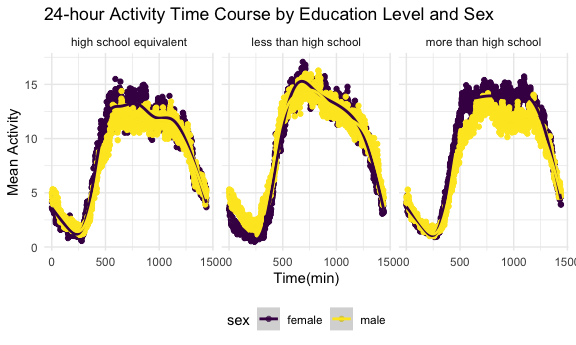
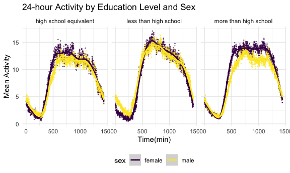

p8105_hw3_vas2145
================
2023-10-14

\#Set up \##Loading libraries and setting standards.

``` r
library(tidyverse)
```

    ## ── Attaching core tidyverse packages ──────────────────────── tidyverse 2.0.0 ──
    ## ✔ dplyr     1.1.3     ✔ readr     2.1.4
    ## ✔ forcats   1.0.0     ✔ stringr   1.5.0
    ## ✔ ggplot2   3.4.3     ✔ tibble    3.2.1
    ## ✔ lubridate 1.9.2     ✔ tidyr     1.3.0
    ## ✔ purrr     1.0.2     
    ## ── Conflicts ────────────────────────────────────────── tidyverse_conflicts() ──
    ## ✖ dplyr::filter() masks stats::filter()
    ## ✖ dplyr::lag()    masks stats::lag()
    ## ℹ Use the conflicted package (<http://conflicted.r-lib.org/>) to force all conflicts to become errors

``` r
library(ggplot2)
library(ggridges)
library(patchwork)

knitr::opts_chunk$set(
  fig.width = 6,
  fig.asp = .6,
  out.width = "90%"
)

theme_set(theme_minimal() + theme(legend.position = "bottom"))

options(
  ggplot2.continuous.colour = "viridis",
  ggplot2.continuous.fill = "viridis"
)

scale_colour_discrete = scale_colour_viridis_d
scale_fill_discrete = scale_fill_viridis_d
```

\#Problem 1 \##Loading in Dataset

``` r
library(p8105.datasets)
data("instacart")

instacart =
  instacart |> 
  as_tibble()
```

The `instacart` dataset includes 15 variables of 1384617 observations.
The datset includes information such as `order_id`, which is the order
number assigned to a particular user, identified by `user_id`. It
includes timing of the order, including the day of week
(`order_dow), the hour of the order (`order_hour_od_day`) and the amount of time since a previous order was placed by the user (`days_since_prior_order`). It also includes the`product_name`, the product`aisle`and the`department\`
the product came from. In total, there are 134 aisles, with the fresh
vegetables and fresh fruits aisles being the mostly highly ordered from.

``` r
instacart |> 
  count(aisle_id)
```

    ## # A tibble: 134 × 2
    ##    aisle_id     n
    ##       <int> <int>
    ##  1        1  2936
    ##  2        2  3873
    ##  3        3 17449
    ##  4        4  9917
    ##  5        5  2905
    ##  6        6  1795
    ##  7        7  1526
    ##  8        8  1501
    ##  9        9  9736
    ## 10       10   448
    ## # ℹ 124 more rows

``` r
instacart |> 
  count(aisle_id) |> 
  arrange(desc(n))
```

    ## # A tibble: 134 × 2
    ##    aisle_id      n
    ##       <int>  <int>
    ##  1       83 150609
    ##  2       24 150473
    ##  3      123  78493
    ##  4      120  55240
    ##  5       21  41699
    ##  6      115  36617
    ##  7       84  32644
    ##  8      107  31269
    ##  9       91  26240
    ## 10      112  23635
    ## # ℹ 124 more rows

Plot showing the number of items ordered from each aisle:

``` r
instacart |> 
  count(aisle) |> 
  filter(n > 10000) |> 
  mutate(aisle = fct_reorder(aisle, n)) |> 
  ggplot(aes(x = aisle, y = n)) + 
  geom_point() + 
  labs(title = "Number of items ordered in each aisle", y = "Number of Items") +
  theme(axis.text.x = element_text(angle = 60, hjust = 1))
```


A table of the three most popular items ordered from “packaged
vegetables fruits”, “baking ingredients” and “dog food care” aisles.
Each of the products from “packaged vegetables fruits” are substantially
more popular than the most popular items from “baking ingredients” and
“dog food care” aisles.

``` r
instacart |> 
  filter(aisle %in% c("baking ingredients", "dog food care", "packaged vegetables fruits")) |> 
  group_by(aisle) |> 
  count(product_name) |> 
  mutate(rank = min_rank(desc(n))) |> 
  filter(rank < 4) |> 
  arrange(desc(n)) |>
  knitr::kable()
```

| aisle                      | product_name                                  |    n | rank |
|:---------------------------|:----------------------------------------------|-----:|-----:|
| packaged vegetables fruits | Organic Baby Spinach                          | 9784 |    1 |
| packaged vegetables fruits | Organic Raspberries                           | 5546 |    2 |
| packaged vegetables fruits | Organic Blueberries                           | 4966 |    3 |
| baking ingredients         | Light Brown Sugar                             |  499 |    1 |
| baking ingredients         | Pure Baking Soda                              |  387 |    2 |
| baking ingredients         | Cane Sugar                                    |  336 |    3 |
| dog food care              | Snack Sticks Chicken & Rice Recipe Dog Treats |   30 |    1 |
| dog food care              | Organix Chicken & Brown Rice Recipe           |   28 |    2 |
| dog food care              | Small Dog Biscuits                            |   26 |    3 |

On average, ustomers generally order “pink lady apples” earlier in the
day than “Coffee Ice Cream,” based on the table below.

``` r
instacart |>
  filter(product_name %in% c("Pink Lady Apples", "Coffee Ice Cream")) |>
  group_by(product_name, order_dow) |>
  summarize(mean_hour = mean(order_hour_of_day)) |>
  pivot_wider(
    names_from = order_dow, 
    values_from = mean_hour) |>
  knitr::kable(digits = 2)
```

    ## `summarise()` has grouped output by 'product_name'. You can override using the
    ## `.groups` argument.

| product_name     |     0 |     1 |     2 |     3 |     4 |     5 |     6 |
|:-----------------|------:|------:|------:|------:|------:|------:|------:|
| Coffee Ice Cream | 13.77 | 14.32 | 15.38 | 15.32 | 15.22 | 12.26 | 13.83 |
| Pink Lady Apples | 13.44 | 11.36 | 11.70 | 14.25 | 11.55 | 12.78 | 11.94 |

\#Problem 2

\##Loading dataset

``` r
library(p8105.datasets)
data("brfss_smart2010")
```

Cleaning data

``` r
brfss_data =
  brfss_smart2010 |> 
  janitor::clean_names() |> 
  rename(state = locationabbr, county = locationdesc) |> 
  filter(topic == "Overall Health",
    response %in% c("Poor", "Fair", "Good", "Very good", "Excellent")) |> 
  mutate(response = factor(
    response, levels = c("Poor", "Fair", "Good", "Very good", "Excellent")))
```

States that observed at 7 or more locations in 2002:

``` r
brfss_2002 =
  brfss_data |> 
  filter(year == "2002") |> 
  group_by(state) |> 
  summarise(locations = n_distinct(county)) |> 
  filter(locations >= 7)
```

Connecticut, Florida, Massachusetts, North Carolina, New Jersey, and
Pennsylvania all observed at 7 or more locations in 2002.

States that observed at 7 or more locations in 2010:

``` r
brfss_2010 =
  brfss_data |> 
  filter(year == "2010") |> 
  group_by(state) |> 
  summarise(locations = n_distinct(county)) |> 
  filter(locations >= 7)
```

California, Colorado, Florida, Massachusetts, Maryland, North Carolina,
Nebraska, New Jersey, New York, Ohio, Pennsylvania, South Carolina,
Texas, and Washington all observed at 7 or more locations in 2010.

\#Dataset limited to “Excellent” responses and contains, year, state,
and a variable that averages the data_value across locations within a
state

``` r
brfss_ex_data = 
  brfss_data |> 
  filter(response == "Excellent") |> 
  group_by(state, year) |> 
  mutate(avg_data_value = mean(data_value, na.rm = TRUE))
```

A “spaghetti” plot of this average value over time within a state:

``` r
ggplot(brfss_ex_data, aes(x = year, y = avg_data_value, group = state, color = state)) +
  geom_line() +
  labs(title = "Average State Data Value By Year", x = "Year", y = "Average Data Value", color = "State") +
  theme_minimal()
```



The spaghetti plot shows highly variable data values by each state over
the years 2002 to 2010, with a general decrease over time.

Two-panel plot showing, for the years 2006, and 2010, distribution of
data_value for responses (“Poor” to “Excellent”) among locations in NY
State:

``` r
brfss_ny_data =
  brfss_data |> 
  filter(state == "NY", year %in% c(2006, 2010)) |> 
  separate(county, into = c("state", "county"), "-") |> 
  select(year, county, response, data_value)
```

``` r
ggplot(brfss_ny_data, aes(x = response, y = data_value)) +
  geom_boxplot() +
  geom_point(aes(color = county)) +
  facet_grid(. ~ year) +
  labs(title = "New York State County Distribution of Data Values, 2006 to 2010", x = "Response", y = "Data Value", color = "County") +
  theme_minimal()
```



Problem 3

\#Import and clean datasets

``` r
demo_data=
  read_csv(file = "data/nhanes_covar.csv", skip = 4) |> 
  janitor::clean_names() |> 
  filter(age >= 21) |> 
  mutate(
    sex = recode(sex, "1" = "male", "2" = "female"),
    education = recode(education, "1" = "less than high school", "2" = "high school equivalent", "3" = "more than high school")) |> 
  mutate(
    sex = factor(sex),
    education = factor(education)) |> 
  drop_na()
```

    ## Rows: 250 Columns: 5
    ## ── Column specification ────────────────────────────────────────────────────────
    ## Delimiter: ","
    ## dbl (5): SEQN, sex, age, BMI, education
    ## 
    ## ℹ Use `spec()` to retrieve the full column specification for this data.
    ## ℹ Specify the column types or set `show_col_types = FALSE` to quiet this message.

``` r
accel_data =
  read_csv(file = "data/nhanes_accel.csv") |> 
  janitor::clean_names()
```

    ## Rows: 250 Columns: 1441
    ## ── Column specification ────────────────────────────────────────────────────────
    ## Delimiter: ","
    ## dbl (1441): SEQN, min1, min2, min3, min4, min5, min6, min7, min8, min9, min1...
    ## 
    ## ℹ Use `spec()` to retrieve the full column specification for this data.
    ## ℹ Specify the column types or set `show_col_types = FALSE` to quiet this message.

\#merge the datasets:

``` r
merged_data =
  left_join(demo_data, accel_data, by = "seqn")
```

\#Reader-friendly table for the number of men and women in each
education category:

``` r
table_education_sex = merged_data |> 
  group_by(sex, education) |> 
  summarise(count = n(), .groups = "drop") |> 
  pivot_wider(names_from = sex, values_from = count)
  knitr::kable(table_education_sex, caption = "Number of Men and Women in Each Education Category")
```

| education              | female | male |
|:-----------------------|-------:|-----:|
| high school equivalent |     23 |   35 |
| less than high school  |     28 |   27 |
| more than high school  |     59 |   56 |

Number of Men and Women in Each Education Category

Most respondents had `more than high school` education, with females
having a greater amount of `more than high school` education than males.

\#create a visualization of the age distributions for men and women in
each education category

``` r
merged_data |> 
  ggplot(aes(x = education, y = age, fill = sex)) +
    geom_point(alpha = .5) +
    labs(title = "Age Distribution by Sex and Level of Education",
         x = "Level of Education",
         y = "Age") +
   theme_minimal()
```



``` r
merged_data |> 
  ggplot(aes(x = education, y = age, fill = sex)) +
    geom_boxplot() +
    labs(title = "Age Distribution by Sex and Level of Education",
         x = "Level of Education",
         y = "Age") +
   theme_minimal()
```



Generally, females with more than a high school education are, on
average, younger than females with a high school equivalent or less than
a high school education, whereas males with less than a high school
education are, on average, older than those with a high school
equivalent or more than a high school education.

\#aggregate across minutes to create a total activity variable for each
participant:

``` r
total_activity_data = merged_data |> 
  mutate(
    total_activity = rowSums(across(c(min1:min45))))
```

\#Plot of total activities (y-axis) against age (x-axis), comparing men
to women with separate panels for each education level and a trend line
to illustrate differences

``` r
ggplot(total_activity_data, aes(x = age, y = total_activity, color = sex)) +
  geom_point() +
  geom_smooth(se = FALSE) +
  facet_wrap(~ education) +
  labs(title = "Total Activity by Sex and Level of Education",
       x = "Age",
       y = "Total Activity")
```

    ## `geom_smooth()` using method = 'loess' and formula = 'y ~ x'



Across all levels of education, total activity levels decrease from age
20 to age 80. For women, activity levels typically increase between ages
40 and 50, while men typically have decreasing levels of activity
between this period.

\#three-panel plot that shows the 24-hour activity time courses for each
education level and use color to indicate sex

``` r
time_course_data = total_activity_data |> 
  group_by(education, sex) |> 
  summarize(across(starts_with("min"), ~mean(.), .names = "mean_{.col}")) |> 
  pivot_longer(
    cols = starts_with ("mean"),
    names_to = "time",
    values_to = "mean") |> 
  mutate(time = substring(time, 9),
         time = as.numeric(time))
```

    ## `summarise()` has grouped output by 'education'. You can override using the
    ## `.groups` argument.

``` r
time_course_data |> 
  ggplot(aes(x = time, y = mean, color = sex)) +
  geom_point() +
  geom_smooth() +
  facet_wrap(. ~ education) +
  labs(title = "24-hour Activity Time Course by Education Level and Sex",
       x = "Time(min)",
       y = "Mean Activity")
```

    ## `geom_smooth()` using method = 'gam' and formula = 'y ~ s(x, bs = "cs")'



``` r
time_course_data |> 
  ggplot(aes(x = time, y = mean, color = sex)) +
  geom_point(alpha = .5, size = .2) +
  geom_smooth() +
  facet_wrap(. ~ education) +
  labs(title = "24-hour Activity by Education Level and Sex",
       x = "Time(min)",
       y = "Mean Activity")
```

    ## `geom_smooth()` using method = 'gam' and formula = 'y ~ s(x, bs = "cs")'



For all levels of education, activity dips in the morning, before
increasing at midday. Those with less than a high school education have,
on average, greater levels of activity at most time points within the
day, with those with a high school equivalent education having, on
average, the lowest amount of activity level.
