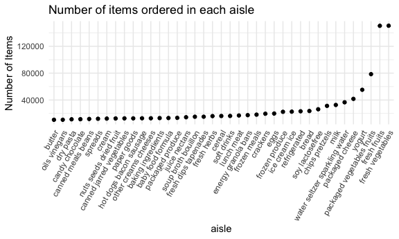

p8105_hw3_vas2145
================
2023-10-14

\#Set up \##Loading libraries and setting standards.

``` r
library(tidyverse)
```

    ## ── Attaching core tidyverse packages ──────────────────────── tidyverse 2.0.0 ──
    ## ✔ dplyr     1.1.3     ✔ readr     2.1.4
    ## ✔ forcats   1.0.0     ✔ stringr   1.5.0
    ## ✔ ggplot2   3.4.3     ✔ tibble    3.2.1
    ## ✔ lubridate 1.9.2     ✔ tidyr     1.3.0
    ## ✔ purrr     1.0.2     
    ## ── Conflicts ────────────────────────────────────────── tidyverse_conflicts() ──
    ## ✖ dplyr::filter() masks stats::filter()
    ## ✖ dplyr::lag()    masks stats::lag()
    ## ℹ Use the conflicted package (<http://conflicted.r-lib.org/>) to force all conflicts to become errors

``` r
library(ggridges)
library(patchwork)

knitr::opts_chunk$set(
  fig.width = 6,
  fig.asp = .6,
  out.width = "90%"
)

theme_set(theme_minimal() + theme(legend.position = "bottom"))

options(
  ggplot2.continuous.colour = "viridis",
  ggplot2.continuous.fill = "viridis"
)

scale_colour_discrete = scale_colour_viridis_d
scale_fill_discrete = scale_fill_viridis_d
```

\#Problem 1 \##Loading in Dataset

``` r
library(p8105.datasets)
data("instacart")

instacart =
  instacart |> 
  as_tibble()
```

The `instacart` dataset includes 15 variables of 1384617 observations.
The datset includes information such as `order_id`, which is the order
number assigned to a particular user, identified by `user_id`. It
includes timing of the order, including the day of week
(`order_dow), the hour of the order (`order_hour_od_day`) and the amount of time since a previous order was placed by the user (`days_since_prior_order`). It also includes the`product_name`, the product`aisle`and the`department\`
the product came from. In total, there are 134 aisles, with the fresh
vegetables and fresh fruits aisles being the mostly highly ordered from.

``` r
instacart |> 
  count(aisle_id)
```

    ## # A tibble: 134 × 2
    ##    aisle_id     n
    ##       <int> <int>
    ##  1        1  2936
    ##  2        2  3873
    ##  3        3 17449
    ##  4        4  9917
    ##  5        5  2905
    ##  6        6  1795
    ##  7        7  1526
    ##  8        8  1501
    ##  9        9  9736
    ## 10       10   448
    ## # ℹ 124 more rows

``` r
instacart |> 
  count(aisle_id) |> 
  arrange(desc(n))
```

    ## # A tibble: 134 × 2
    ##    aisle_id      n
    ##       <int>  <int>
    ##  1       83 150609
    ##  2       24 150473
    ##  3      123  78493
    ##  4      120  55240
    ##  5       21  41699
    ##  6      115  36617
    ##  7       84  32644
    ##  8      107  31269
    ##  9       91  26240
    ## 10      112  23635
    ## # ℹ 124 more rows

Plot showing the number of items ordered from each aisle:

``` r
instacart |> 
  count(aisle) |> 
  filter(n > 10000) |> 
  mutate(aisle = fct_reorder(aisle, n)) |> 
  ggplot(aes(x = aisle, y = n)) + 
  geom_point() + 
  labs(title = "Number of items ordered in each aisle", y = "Number of Items") +
  theme(axis.text.x = element_text(angle = 60, hjust = 1))
```



A table of the three most popular items ordered from “packaged
vegetables fruits”, “baking ingredients” and “dog food care” aisles.
Each of the products from “packaged vegetables fruits” are substantially
more popular than the most popular items from “baking ingredients” and
“dog food care” aisles.

``` r
instacart |> 
  filter(aisle %in% c("baking ingredients", "dog food care", "packaged vegetables fruits")) |> 
  group_by(aisle) |> 
  count(product_name) |> 
  mutate(rank = min_rank(desc(n))) |> 
  filter(rank < 4) |> 
  arrange(desc(n)) |>
  knitr::kable()
```

| aisle                      | product_name                                  |    n | rank |
|:---------------------------|:----------------------------------------------|-----:|-----:|
| packaged vegetables fruits | Organic Baby Spinach                          | 9784 |    1 |
| packaged vegetables fruits | Organic Raspberries                           | 5546 |    2 |
| packaged vegetables fruits | Organic Blueberries                           | 4966 |    3 |
| baking ingredients         | Light Brown Sugar                             |  499 |    1 |
| baking ingredients         | Pure Baking Soda                              |  387 |    2 |
| baking ingredients         | Cane Sugar                                    |  336 |    3 |
| dog food care              | Snack Sticks Chicken & Rice Recipe Dog Treats |   30 |    1 |
| dog food care              | Organix Chicken & Brown Rice Recipe           |   28 |    2 |
| dog food care              | Small Dog Biscuits                            |   26 |    3 |

On average, ustomers generally order “pink lady apples” earlier in the
day than “Coffee Ice Cream,” based on the table below.

``` r
instacart |>
  filter(product_name %in% c("Pink Lady Apples", "Coffee Ice Cream")) |>
  group_by(product_name, order_dow) |>
  summarize(mean_hour = mean(order_hour_of_day)) |>
  pivot_wider(
    names_from = order_dow, 
    values_from = mean_hour) |>
  knitr::kable(digits = 2)
```

    ## `summarise()` has grouped output by 'product_name'. You can override using the
    ## `.groups` argument.

| product_name     |     0 |     1 |     2 |     3 |     4 |     5 |     6 |
|:-----------------|------:|------:|------:|------:|------:|------:|------:|
| Coffee Ice Cream | 13.77 | 14.32 | 15.38 | 15.32 | 15.22 | 12.26 | 13.83 |
| Pink Lady Apples | 13.44 | 11.36 | 11.70 | 14.25 | 11.55 | 12.78 | 11.94 |
